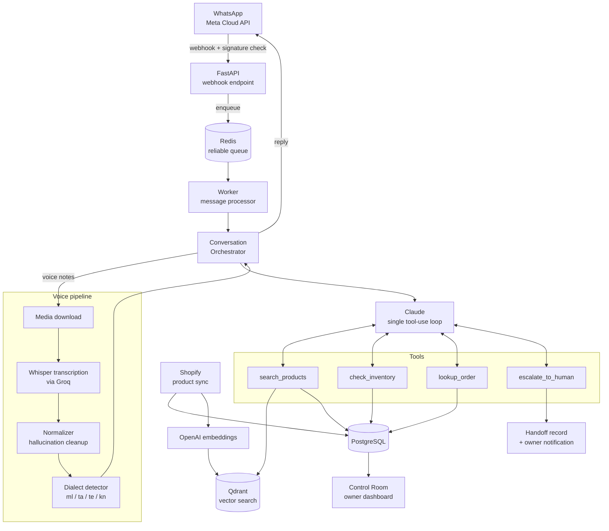

# Avni — Agentic WhatsApp Commerce CRM

**Avni** is a production-grade, agentic WhatsApp commerce assistant built for a boutique fashion retailer, powered by a **single Claude tool-use loop**. Customers chat (or send voice notes in South Indian languages) on WhatsApp; Avni searches the catalog, checks live inventory, looks up orders, and escalates to a human when policy demands it — all in one model call cycle.

Published here with all client-identifying data replaced by a fictional demo brand ("DemoBoutique"); the assistant's name is used with the client's permission.

## Highlights

- **Agentic pipeline, not a prompt chain.** One Claude call drives the whole conversation turn via four tools: `search_products`, `check_inventory`, `lookup_order`, `escalate_to_human`.
- **Dialect-aware voice pipeline.** Whisper (`whisper-large-v3-turbo` via Groq) transcription with hallucination cleanup and dialect detection for Malayalam, Tamil, Telugu, and Kannada — down to regional dialect markers (Thrissur vs. Malabar Malayalam, Telangana vs. Coastal Andhra Telugu, ...).
- **Semantic product search.** OpenAI embeddings + Qdrant vector store, with store-scoped filtering and Postgres as the source of truth.
- **Human handoff with hard guardrails.** Policy-sensitive requests (refunds, disputes, payments) are never auto-answered — they create a handoff record and route to the owner's Control Room.
- **Avni Control Room.** A single-page operational dashboard for the owner (health, conversations, handoffs, system events, CSV exports) served straight from FastAPI.
- **Production hygiene.** Webhook signature verification (`X-Hub-Signature-256`), PII-masked logging, Redis reliable-queue with crash recovery, `tenacity` retries on every external API, env validation at startup, separate dev/prod compose files.

## Architecture



### The 7-step conversation turn

1. Resolve customer + conversation
2. Persist inbound message
3. Short-circuit if a human agent has taken over
4. Process content (text passthrough, or the voice pipeline: transcribe → normalize → detect dialect)
5. **Single Claude call with tools** — the agentic loop runs until Claude produces a final reply
6. Execute the result (send reply / create handoff / fallback)
7. Update customer last-seen

### The migration story: 11 steps → 7

The first version was a classic serial pipeline: **intent extraction (Claude call #1) → keyword/vector product search → response generation (Claude call #2) → a rule-based decision engine** deciding whether to reply or escalate — 11 steps end to end.

It was replaced by a single Claude **tool-use** loop. The model itself decides when to search, when to check stock, and when to escalate. That migration:

- **deleted** the intent extractor, its prompt module, and the entire decision engine
- cut the pipeline from 11 steps to 7
- halved the number of "must not disagree with each other" AI stages (2 → 1)
- made new capabilities a matter of *adding a tool*, not rewiring a pipeline

Fewer moving parts, fewer failure modes, and the model reasons over live data instead of a stale pre-fetched context block.

## Stack

| Layer | Technology |
|---|---|
| API | FastAPI (async), Uvicorn |
| Agent | Anthropic Claude (tool use), 4 tools |
| Voice | Whisper `whisper-large-v3-turbo` (Groq) + custom normalizer + dialect detector |
| Embeddings | OpenAI `text-embedding-3-small` |
| Vector search | Qdrant |
| Database | PostgreSQL 16, SQLAlchemy 2 (async) + asyncpg, Alembic migrations |
| Queue / cache | Redis 7 (reliable-list queue with recovery) |
| Messaging | Meta WhatsApp Cloud API (signed webhooks) |
| Catalog | Shopify Admin API sync (or mock catalog, no credentials needed) |
| Resilience | tenacity retries on Claude / OpenAI / Groq / WhatsApp / Qdrant |
| Packaging | Docker + docker-compose (dev and prod variants), Makefile |

## Quickstart

Prerequisites: Docker + Docker Compose.

```bash
git clone <this-repo>
cd whatsapp-agentic-crm

# 1. Configure (only the AI keys are needed to play locally)
cp .env.example .env

# 2. Start the stack: Postgres, Redis, Qdrant, app, worker
docker compose up -d

# 3. Apply migrations
docker compose exec app alembic upgrade head

# 4. Create a store (prints its UUID), then seed the demo catalog (no Shopify account needed)
docker compose exec app python -m scripts.setup_store \
  --name "DemoBoutique" --slug "demoboutique" \
  --shopify-domain "demoboutique.myshopify.com" --shopify-token "placeholder" \
  --whatsapp-phone "+919876543210"
docker compose exec app python -m scripts.setup_demo --store-id <uuid-from-above>

# 5. Health check
docker compose exec app python -m scripts.health_check
```

Then open:

- API docs: http://localhost:8000/docs
- Control Room: http://localhost:8000/control-room
- Health: http://localhost:8000/health

Try the pipeline end-to-end without WhatsApp:

```bash
docker compose exec app python -m scripts.test_full_pipeline \
  --store-id <uuid> --message "Looking for a wedding saree under 10000"
```

For real WhatsApp traffic, see `docs/WHATSAPP_SETUP.md`; for Shopify sync, `docs/SHOPIFY_SETUP.md`; for production deployment, `docs/DEPLOYMENT.md` and `docker-compose.prod.yml`.

## Tests

80+ tests: unit tests for the tool loop, webhook signature verification, dialect detection, transcription normalization, policy gates, tenant isolation, and PII redaction; integration tests for the orchestrator and both APIs.

```bash
# Everything (DB integration tests need the Postgres container)
docker compose exec app pytest tests/ -v

# Or locally
pip install -e ".[dev]"
pytest tests/ -v
```

DB-backed integration tests are marked `db` and **skip automatically** when PostgreSQL isn't reachable — the rest of the suite runs green with no services at all.

There is also a zero-cost readiness harness (`python -m scripts.demo_dry_run_check`) and an offline policy evaluator (`python -m scripts.evaluate_demo_policy`) that validate guardrail behavior deterministically, without spending a single AI token.

## Voice replies (ElevenLabs demo)

The production pipeline is voice-native in one direction: customers send
Malayalam voice notes, Whisper (`whisper-large-v3`) transcribes them, and the
agent replies in text. `demo/elevenlabs_voice_reply.py` closes the loop — the
same reply text renders as a spoken voice note via ElevenLabs **`eleven_v3`**,
one of the few TTS models that speaks Malayalam.

Three committed samples in [`demo/audio/`](demo/audio/), generated by the
script from real Avni reply shapes:

- [`reply-malayalam.mp3`](demo/audio/reply-malayalam.mp3) — product availability answer, Malayalam
- [`reply-english.mp3`](demo/audio/reply-english.mp3) — order status, English
- [`reply-manglish.mp3`](demo/audio/reply-manglish.mp3) — Malayalam–English code-switch, the way Kerala actually texts

```bash
export ELEVENLABS_API_KEY=...   # free tier is enough
python demo/elevenlabs_voice_reply.py --demo                      # regenerate the samples
python demo/elevenlabs_voice_reply.py "any reply text" -o out.mp3 # speak anything
```

Honesty notes: this was built in one afternoon as a demo, it is not wired into
the live reply path; the voice ("Bella") was chosen by a native Malayalam
speaker's ear test — verdict roughly 90% natural, with occasional pronunciation
slips. Voice synthesis by [ElevenLabs](https://elevenlabs.io); demo audio is
non-commercial, generated on the free tier with attribution per its terms.

## Repository map

```
src/
  api/            # webhook, agent dashboard API, Control Room (API + UI)
  core/           # orchestrator (7-step turn), context builder, privacy/PII masking
  services/
    ai/           # Claude client, tools, tool executor, prompts, embeddings
    speech/       # transcriber, normalizer, dialect detector
    whatsapp/     # Cloud API client, parser, media, outbound policy
    shopify/      # client + product sync
    demo/         # offline policy evaluator
  db/             # async engine, repositories, Qdrant vector store
  models/         # SQLAlchemy models
  workers/        # queue helpers + message processor
alembic/          # migrations
data/demo/        # fictional demo catalog + business profile (DemoBoutique)
demo/             # ElevenLabs voice-reply demo + committed audio samples
scripts/          # setup, sync, health check, manual pipeline probes
tests/            # unit + integration (80+)
docs/             # architecture, deployment, WhatsApp/Shopify setup
```

## Credits

Built by **Jachin Victor** — [github.com/Lexy-Boa](https://github.com/Lexy-Boa)

All customer data, brand names, and catalog content in this repository are fictional. The system was originally built for a boutique fashion retailer; nothing in this repo identifies them.
